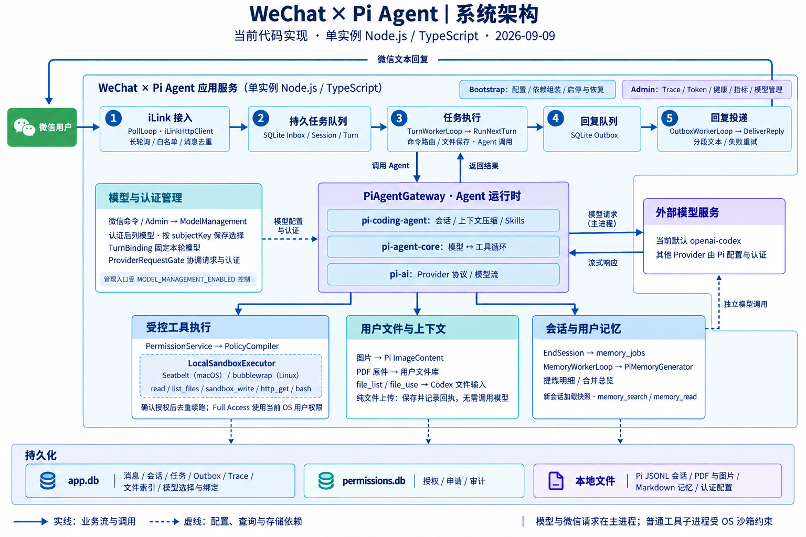

# WeChat × Pi Agent

通过微信 iLink 使用的个人 AI 助手。基于 Node.js / TypeScript，使用 Pi SDK 驱动 Agent，支持文字、图片、PDF、用户文件库、用户记忆和受控工具执行。

开发维护从 [AGENTS.md](AGENTS.md) 和 [文档地图](docs/README.md) 开始；[业务需求](docs/specs/README.md) 定义目标与验收，[变更与计划](docs/changelog/README.md) 记录进度。下一步方向为 [Agent Harness](docs/specs/agent-harness/requirements.md)，首期范围待澄清。

## 当前能力

| 能力 | 实现范围 |
|---|---|
| 微信消息 | iLink 扫码登录、长轮询接收、typing、分段文本回复。正式模式按发送者白名单入库与执行。 |
| 模型与上下文 | `pi-coding-agent` / `pi-agent-core` / `pi-ai` 在进程内运行；持久化 Pi 会话历史、上下文压缩和应用回执。 |
| Skills | 工程 `skills/`、Pi 项目/用户来源；同名优先级、自然语言按需加载和 `/skill:名称`。 |
| 图片 | 接收 JPEG、PNG、GIF、WebP，解密保存后作为图片内容交给支持视觉输入的模型。 |
| PDF 文件库 | 按用户保存原件，跨 Session 查询；通过 Codex 上传和短期链接，将原 PDF 作为模型输入。 |
| 用户记忆 | 会话结束后后台提炼明细、合并总览；新 Session 加载总览快照，支持关键词搜索和按行读取。 |
| 权限与沙箱 | 持久化授权、对话确认、授权后去重续跑；普通工具受系统沙箱约束，支持显式 Full Access。 |
| 可观测性 | Session / Turn / 模型 / 工具 Trace，实际请求与输出、Token、文件/记忆事件，以及健康与指标接口。 |

**当前边界**：微信回复仍是文本，不回传图片或文件；原始 PDF 输入只接入官方 Codex 后端；记忆搜索不使用 embedding。Pi 的其他模型通道依赖其认证与模型配置，不代表都已接入文件输入。

## 系统架构

### 技术模块与职责



[查看原图](docs/architecture/current-system-2026-09-09.png) · [架构说明与源码依据](docs/architecture/current-system-2026-09-09.md) · [制图提示词](docs/architecture/current-system-2026-09-09.prompt.txt)。图基于 2026-09-09 本地源码，涵盖消息主链路、Agent 运行时、模型与认证、工具沙箱、文件、记忆和持久化；实线表示业务流与调用，虚线表示配置、查询与存储依赖。

应用以单实例 Node.js / TypeScript 服务运行。Bootstrap 是启动与组装入口：加载配置和认证、创建组件并注入依赖、启动管理接口和后台循环、协调退出收尾。它不属于消息接入模块，也不参与逐条消息处理。浏览器打开 `/admin` 即管理页，主要用于旁路查询 Trace 与运行状态。

| 职责模块 | 驱动与用例 | 领域模型与结果 |
|---|---|---|
| 消息接入 | `PollLoop → IngestMessage`：发送者校验、去重、会话关联、持久化和入队 | `InboundMessage`；Inbox、cursor、待执行 Turn |
| 任务执行 | `TurnWorkerLoop → RunNextTurn`：领取任务、处理命令和文件、按需调用 Agent、保存结果 | `Turn / Step`；执行结果与 Outbox |
| 回复投递 | `OutboxWorkerLoop → DeliverReply`：领取回复、经 Channel 发送、记录结果和重试 | `OutboxMessage`；发送状态与重试时间 |
| 会话与记忆 | `EndSession`、闲置扫描与记忆 worker：归档、提炼、合并、搜索和读取 | `Session / UserMemory / MemoryJob`；Markdown 正文与任务状态 |
| 权限与工具 | 授权确认、策略编译、受控执行 | 授权、申请、权限主体与审计 |
| 用户文件 | 保存、查询、选用和模型附件转换 | `UserFile` 与模型文件引用 |
| 模型与认证 | 微信命令 / Admin → `ModelManagement`；Provider 认证、模型选择与请求协调 | 按可信 `subjectKey` 保存选择；`TurnBinding` 固定本轮模型 |

这是现有代码的职责视图；模块共享持久化适配器。Adapter 是项目实现的边界封装：iLink 使用原生 `fetch`，Admin 使用 `node:http`，存储使用 `node:sqlite` / `node:fs`；`PiAgentGateway` 封装 Pi SDK。

应用调度由 SQLite 持久队列和五个异步循环实现，单个 Turn worker 串行执行，记忆 worker 独立运行。单 Turn 内的模型与工具循环由 `pi-agent-core` 驱动，`pi-coding-agent` 管理会话与资源，`pi-ai` 处理 Provider 协议与模型流。

权限校验位于应用服务层，OS 沙箱位于工具执行适配器：`PermissionService → PolicyCompiler → LocalSandboxExecutor`。工具子进程通过 `@anthropic-ai/sandbox-runtime` 使用 Seatbelt / bubblewrap；微信收发和模型请求在主服务控制面。记忆使用双层 Markdown 正文与 SQLite 后台任务状态，生成和读取是独立路径。

模型管理入口受 `MODEL_MANAGEMENT_ENABLED` 控制。认证后列出对应 Provider 的模型，`ProviderRequestGate` 协调模型调用与认证操作。外部模型服务通过主进程请求访问。

### 消息与能力流程

消息主链：

```text
微信 → iLinkHttpClient → IngestMessage → SQLite Inbox / Session / Turn
     → RunNextTurn → PiAgentGateway → Pi SDK / pi-ai → 模型服务
     → SQLite Outbox → DeliverReply → 微信文本回复
```

- `PollLoop`、`TurnWorkerLoop`、`OutboxWorkerLoop` 分别处理接收、执行和发送。
- 生命周期扫描每分钟检查闲置 Session；`EndSession` 统一处理 `/new`、闲置、退出和启动恢复。
- `MemoryWorkerLoop` 独立领取记忆任务，使用 `PiMemoryGenerator` 提炼与合并，不执行聊天工具。
- 普通文件/命令/网络工具走 `PermissionService → PolicyCompiler → LocalSandboxExecutor`。
- 用户文件与记忆通过专用工具访问；图片、文件传输、模型调用和微信收发由控制面处理，不需要开启 Bash 或普通工具网络权限。

架构图表示当前代码结构；精确行为以以下说明和代码为准，不代表真实账号或运行环境验收结论。

## 快速开始

要求：Node.js **22.19 或更高**。受限工具在 macOS 使用 `sandbox-exec`；Linux 需要 bubblewrap、socat、ripgrep。其他平台若无法建立沙箱，会拒绝受限执行。真实系统沙箱测试目前覆盖 macOS。

```bash
npm ci
npm run check

# 首次使用时创建配置；已有 .env 不覆盖
[ -f .env ] || cp .env.example .env
npm run dev
```

`.env.example` 默认 `DRY_RUN=true`。此模式不访问微信或模型，用于验证进程、SQLite、worker 和管理接口；回复与记忆提炼使用确定性替身，不代表真实模型能力验收。

默认管理页：[http://127.0.0.1:9464/admin](http://127.0.0.1:9464/admin)。修改了 `ADMIN_PORT` 时，使用实际端口。

### 正式运行

将 `.env` 中的 `DRY_RUN` 改为 `false`，在终端执行 `npm run dev`。

默认 provider 是 `openai-codex`，需要有效的 Codex 登录。首次交互式启动会处理缺失项：

1. iLink 凭证缺失：显示二维码，等待微信扫码授权。
2. 模型认证缺失：调用 Pi 的 OAuth 登录流程。
3. `PI_MODEL_ID` 未配置且未绑定模型：从当前 provider 的模型列表选择并保存。
4. 启动 worker 和管理接口。

非交互环境须提前准备凭证及模型配置，不能依赖终端询问。其他 provider 应先完成其 Pi 认证配置；此项目未逐个验证所有 provider 的交互登录流程。

需要重新进行微信扫码登录时：

```bash
npm run ilink:login
```

构建后运行：

```bash
npm run build
npm start
```

部署不能只复制 `dist/`：还需要运行依赖、配置，以及启用时的工程 `skills/`。默认 `SYSTEM_PROMPT_PATH` 指向 `src/prompts/wechat-assistant.md`；若仅部署构建产物，请显式改为构建中复制的 `dist/prompts/wechat-assistant.md`。记忆生成提示词也会复制到 `dist/prompts/`。

### 主要配置

完整示例见 [.env.example](.env.example)。

| 配置 | 默认值 / 用途 |
|---|---|
| `WORKSPACE_ROOT` | `.`，工程根目录与工作区身份 |
| `DATA_DIR` | `./data`，数据库、文件、记忆等运行数据 |
| `DRY_RUN` | 配置示例为 `true`；代码未提供该变量时默认 `false` |
| `ADMIN_HOST` / `ADMIN_PORT` | `127.0.0.1` / `9464` |
| `PI_PROVIDER` | `openai-codex` |
| `PI_MODEL_ID` | 空时使用已绑定模型或首次交互选择 |
| `PI_THINKING_LEVEL` | `medium` |
| `PI_AUTH_PATH` | `~/.pi/agent/auth.json` |
| `PI_MODELS_STORE_PATH` | `~/.pi/agent/models.json` |
| `PI_LOAD_LOCAL_SKILLS` | `false`；开启后加载工程及 Pi 的 Skill 来源 |
| `SYSTEM_PROMPT_PATH` | `./src/prompts/wechat-assistant.md`，文件缺失或为空时启动失败 |
| `TOOL_SANDBOX_ROOT` | 未显式配置时为 `DATA_DIR/tool-workspace` |
| `ILINK_ALLOWED_SENDER_ID` | 限定发送者；未设置时回退配置用户 ID 或扫码返回的用户 ID |
| `PERMISSION_EXECUTOR_ID` | 空时生成并保存到 `DATA_DIR/executor-id` |
| `TRACE_RETENTION` | `100`，控制 `agent_traces` 系统提示词快照保留数量 |

旧的 `TOOL_SHELL_ENABLED`、`TOOL_HTTP_ENABLED`、`TOOL_HTTP_ALLOWED_HOSTS` 不再授予权限；授权以权限服务为准。

## 会话生命周期与退出

- `/new`：归档旧 Session，后续已排队的普通消息移入新 Session，旧授权续跑取消。
- **闲置 1 小时**：每分钟扫描；没有 `QUEUED` / `RUNNING` Turn，且最后一次消息入库或 Turn 完成已超过 1 小时，才在事务内归档。
- **正常退出**：收到 SIGINT / SIGTERM 后停止接收与任务领取，给予当前任务最多 30 秒收尾时间；之后发出取消，待取消收尾后归档 Session、持久化记忆任务并关闭资源。退出时不启动新的记忆总结请求。
- **启动恢复**：取得数据目录单实例锁并绑定管理端口后，归档遗留的活动 Session，将未完成 Turn 标为中断取消；不自动重做它们的工具操作。已生成的 Outbox 回复继续走发送恢复。

归档与记忆任务入队在 `app.db` 的同一个事务里完成。权限存储位于独立数据库，会话授权撤销采用幂等补偿。

服务使用数据目录锁，正常退出会释放；硬崩溃不能执行 `finally`，再次启动可能需要等待旧锁过期（当前 30 秒）。更新版本时先停止旧服务，再启动新版。数据库迁移与旧版就绪检查不一定兼容，不应直接用旧二进制读取已升级的数据目录。

**交付语义**：消息入库与 cursor 推进在同一事务中；Outbox 使用稳定 `client_id` 重试，但不承诺服务端已验证的 exactly-once。任务取消不会回滚已经发生的外部副作用。

## 上下文与 Skills

系统提示词位于 [wechat-assistant.md](src/prompts/wechat-assistant.md)。Pi 扩展、prompt templates、themes 和自动项目上下文文件加载关闭；用户记忆通过独立的用户上下文入口加入。

工程 Skill 放在：

```text
skills/<name>/SKILL.md
```

`SKILL.md` 需要非空 `description`，建议明确填写 `name`。当前工程提供目录约定，未预装业务 Skill。[目录说明](skills/README.md)

同名 Skill 按解析后的 `name` 选择整份版本，不合并正文。优先级从高到低：

1. 项目 settings 显式配置的本地路径。
2. 工程 `skills/`。
3. 项目自动发现目录，如 `.pi/skills/`、`.agents/skills/`。
4. 用户 settings 显式配置的本地路径。
5. 用户自动发现目录，如 `~/.pi/agent/skills/`、`~/.agents/skills/`。
6. Pi 资源包提供的 Skill。

其余排序及项目信任规则复用 Pi。工程不默认扫描 `~/.codex/skills/`。`PI_CODING_AGENT_DIR` 可覆盖 Pi Agent 目录。

自然语言调用时，模型从名称/简介/路径目录中选择，再用 `read` 加载正文；`/skill:名称 参数` 则先校验名称并展开正文。两者均记录 `skill_load`，未知名称或文件不可读会明确反馈。目录在启动时加载，新增或修改名称/简介后需重启。

**应用回执也属于对话上下文**：纯 PDF 上传后立即加入上传信息和保存回执，并记录 `context_update`，不调用模型。重启、压缩或同步失败后，缺失记录由 `context_replay` 兜底补入；已在活动上下文中的事件不会重复追加。

## 图片与 PDF 文件

| 输入 | 当前限制与行为 |
|---|---|
| 图片 | JPEG / PNG / GIF / WebP；每条最多处理 4 张，每张解密后最多 15 MiB。原图引用缺失时可回退缩略图。 |
| PDF | 单文件最多 20 MiB，每条最多保存 3 份，每轮最多选择 3 份；单用户原件额度 500 MiB。 |

图片会保存到 `DATA_DIR/inbound-media/`，通过 Pi `ImageContent` 加入消息历史；使用前检查模型是否支持图片。当前图片下载发生在 Channel 规范化阶段，SenderPolicy 在之后过滤消息。PDF 则先保存文件引用，经过发送者过滤、消息落库后才在 Turn 中下载。

PDF 原件按用户保存，跨 Session 可用，`/new` 不删除文件：

```text
DATA_DIR/files/<subjectKey>/<fileId>/original.pdf
```

- `file_list(query?, offset?)` 查询当前用户文件，`file_use(fileId)` 选择本轮需要读取的原件。
- 本地 ID 保存在 `user_files`；Codex 远端 ID 保存在 `model_file_refs`，按认证账号作用域隔离。
- 签名下载链接及有效期只做内存缓存。链接失效后重新获取；远端文件不存在时从本地原件重传。
- 模型接入层在 Pi `onPayload` 中附加 `input_file.file_url`，不改 Pi 包，不在系统内解析 PDF，也不另配 OpenAI API Key。
- 文件选择只对当前 Turn 有效；后续需要核对原文时再次 `file_use`。聊天历史保存文件 ID/元信息，不保存签名链接或 PDF Base64。
- 不支持格式、通道未接入、上传或模型失败时明确反馈；原件保存成功后不会因分析失败而删除。

原件和元信息有权限与哈希校验。首版没有文件删除/回传工具或远端文件清理流程；上传失败可能留下远端孤立文件。详细流程和实测范围见 [PDF 设计与实现说明](docs/designs/pdf-attachments/design.md)。

## 用户记忆

```text
DATA_DIR/memory/<subjectKey>/
├── MEMORY.md
└── sessions/YYYY-MM-DD/<sessionId>.md
```

Session 结束后，后台任务先提炼明细，再按需合并总览。Markdown 保存正文，SQLite `memory_jobs` 管理阶段、租约和重试；同一用户按顺序处理，合并期间发现总览被修改时重新尝试，不覆盖新修改。

新 Session 固定加载当时的总览快照，不等待后台整理，也不自动刷新；恢复和压缩继续使用该版本。Agent 可调用 `memory_search` 做字面关键词搜索，再用 `memory_read` 按行读取明细。

总览上限 6000 字符，明细上限 60000 字符；搜索默认最多 20 个命中，最多扫描最新 1000 个明细文件，超限有提示。提炼输入也有明确的轮次和文本预算。首版不提供聊天内直接编辑/删除记忆或自动清理历史明细的工具。

使用现有 Pi 模型认证完成提炼和合并，不调用聊天工具。只提升有证据的事实、明确偏好、决定与未完成事项，不将助手建议或临时权限状态当作长期事实。[完整运行说明](docs/user-memory.md)

## 权限与工具沙箱

默认仅可读写个人工作目录、读取已加载的 Skill 目录。Bash 和普通工具网络默认关闭；`file_*` / `memory_*` 专用工具独立校验用户归属。

常用入口：

- `/permissions` 或“查看权限”。
- `/permissions request shell`、`/permissions request read /绝对目录`、`/permissions request write /绝对目录`。
- `/permissions request network example.com`、`/permissions request full-access`，或用自然语言提出申请。
- 收到申请后由真实用户回复 `确认授权 <编号>`；申请本身不会授予权限。
- `/permissions revoke <编号>`、`/permissions reject <编号>`、`/permissions reset`。

授权绑定真实用户、执行环境、工作区和需要时的 Session。长期授权跨 Session 保留；会话结束撤销会话级与未使用的一次性授权，并取消旧续跑。一次性授权按一次匹配工具尝试消费，失败也消耗。授权有效性与动态权限以权限服务实时查询为准，不能依赖记忆。

Agent 发起的申请可关联被阻塞的 Turn，确认后原子创建一条去重续跑。执行前重新检查会话及权限。**服务结束旧 Session 后，旧续跑不会跨重启自动继续**；这与仍在活动会话内的授权续跑是不同情况。

`read`、`list_files`、`sandbox_write`、`http_get`、`bash` 通过 `LocalSandboxExecutor` 执行。受限模式使用 Seatbelt / bubblewrap；初始化失败不降级到宿主机执行。HTTP 工具只做 HTTPS GET，不跟随重定向；Bash 默认 60 秒、上限 120 秒。

**Full Access** 显式绕过工具沙箱，使用当前 OS 用户的宿主机权限，不自动获得 root。本项目只允许配置的机器所有者申请它；此模式能访问或修改服务与其他本机数据，因此不能承诺跨用户隔离、防篡改审计或回滚。撤销会取消受管执行，不能回滚已有副作用，也不能约束主动脱离受管进程组的后台程序。沙箱本身不提供 CPU/内存配额。

## Trace 与运维

打开 `/admin`：Session 导航、Tree / Chat、节点详情；“记忆任务”切换后台整理记录。

- 每次模型调用有独立输入、实际 Provider 请求、输出、Token 和错误；工具根据真实调用 ID 关联。
- 可读 reasoning 摘要或文本会展示；只有不透明推理状态时显示说明，不解密或推测未返回内容。
- 文件保存、上下文更新、Skill 加载、总览加载和记忆发布均可查看。
- 认证字段、签名 URL、二进制和不透明签名脱敏；单字符串 100 万字符、单快照文本预算 200 万字符，超限明确标记。
- 旧记录未采集过的模型输入输出不能补出。

| 接口 | 用途 |
|---|---|
| `GET /healthz` | 进程存活 |
| `GET /readyz` | 数据库、Channel、模型认证与 worker 健康 |
| `GET /metrics` | Prometheus 指标 |
| `GET /debug/traces?limit=100` | 最近 Turn 列表 |
| `GET /debug/traces/:turnId` | Trace、执行详情与调用树 |
| `GET /debug/turns/:turnId` | Turn 详情 |
| `GET /debug/recent-errors?limit=20` | 最近错误 |
| `GET /debug/memory/jobs` | 最近记忆任务 |
| `GET /debug/memory/jobs/:jobId` | 记忆任务详情与调用树 |

`TRACE_RETENTION` 只控制 `agent_traces` 的系统提示词快照数量，不自动清理 `steps` 或 `memory_job_events` 正文。Admin 默认只监听 localhost，不提供独立登录鉴权；包含私有聊天与记忆数据，不应直接暴露到公网。

## 数据与代码入口

| 路径 | 内容 |
|---|---|
| `DATA_DIR/app.db` | Inbox、Session、Turn、Outbox、Trace、文件索引、远端文件 ID、记忆任务 |
| `DATA_DIR/permissions.db` | 权限策略、申请、回执和审计 |
| `DATA_DIR/files/`、`inbound-media/` | PDF 原件、图片 |
| `DATA_DIR/memory/` | 用户记忆正文 |
| `DATA_DIR/pi-sessions/` | Pi JSONL 历史及会话记忆快照 |
| `DATA_DIR/credentials/ilink.json` | iLink 凭证 |
| `DATA_DIR/settings.json`、`executor-id` | 绑定模型、执行环境身份 |
| `PI_AUTH_PATH` | Pi 模型认证，默认位于用户目录 |

运行数据在 `data/` 下且不进入 Git。迁移到另一执行环境时，不要直接复用执行器身份和权限数据。

- [bootstrap](src/bootstrap/container.ts)：依赖组装、五类循环及关闭流程。
- [application/use-cases](src/application/use-cases)：消息、执行、发送、会话结束及记忆任务编排。
- [application/interfaces](src/application/interfaces)：按职责定义的存储、模型、Channel 和执行边界。
- [pi 适配器](src/adapters/outbound/pi)：会话、工具、上下文、文件协议和模型 Trace。
- [SQLite](src/adapters/outbound/sqlite) / [文件存储](src/adapters/outbound/filesystem) / [沙箱](src/adapters/outbound/sandbox)：具体实现。

## 验证状态

当前代码已通过 109 个自动化测试、类型检查、Lint 和构建。覆盖消息/文件、权限与真实 macOS 沙箱、上下文、Trace、记忆阶段重试、版本一致性、闲置结束、真实子进程 SIGTERM 和退出后任务恢复。

以下命令会使用当前模型认证并消耗用量；只使用隔离临时目录和合成数据：

```bash
npm run build
node scripts/verify-file-input.mjs --live
node scripts/verify-memory.mjs --live
```

已完成的真实模型验证：[PDF 上传及跨会话读取](docs/designs/pdf-attachments/gateway-verification.json)、[记忆提炼、合并与新会话回忆](docs/memory-verification.json)。这不等同于所有文件格式、所有 provider、Linux 沙箱或真实微信全链路已验收。


## 运行时模型、供应商与账户管理

设置 `MODEL_MANAGEMENT_ENABLED=true` 后重启一次服务，即可使用微信管理命令和本机页面 `http://127.0.0.1:<ADMIN_PORT>/admin/models`。后续模型切换不需要重启。默认关闭管理入口；关闭后已有用户模型选择继续生效。管理页仅限运行 Agent 的电脑访问，手机上的 localhost 不指向这台电脑。

| 命令 | 行为 |
|---|---|
| `-help` / `--help` / `/help` | 总帮助；无需模型认证 |
| `/provider` | 当前选择和已配置供应商 |
| `/provider all [页码]` | Pi 已注册供应商，包含未配置认证项 |
| `/provider <供应商>` | 检查认证并展示模型，不切换 |
| `/provider <供应商> page <页码>` | 目标供应商模型列表翻页 |
| `/provider <供应商> <模型ID>` | 校验后同时切换供应商与模型 |
| `/model` / `/models` | 当前供应商的模型列表 |
| `/model page <页码>` | 当前供应商模型列表翻页 |
| `/model <模型ID>` | 当前供应商内切换 |
| `/auth` / `/auth <供应商>` | 本地认证状态、方式和指引 |
| `/auth <供应商> login` | 创建首次认证操作，在本机页面完成 |
| `/auth <供应商> reauth` | 创建重新认证/换账户操作，在本机页面完成 |

`/provider -help`、`/model -help`、`/auth -help` 等显示对应帮助，兼容 `--help`。只有明确完整匹配的命令进入管理逻辑；未知命令、参数数量不匹配或包含解释性文字时，原文交给 Agent，不自动纠错。管理命令请单独发送，附带图片/文件时作为普通消息处理，以保留附件处理流程。

用户模型选择按可信 subjectKey 存入 SQLite，跨会话/重启保留。环境变量和原 data/settings.json 仅作为没有用户选择时的初始默认。`/model` 永远对应当前供应商，没有隐藏的“待选供应商”。完整合法命令内找不到模型或认证失败会明确提示，不修改当前选择。

模型在每个 Turn 开始时固定，工具往返、文件适配和 Trace 使用同一个模型；切换只影响尚未开始的新任务，恢复重试沿用原 Turn 绑定。微信命令共用单 Turn worker，长任务期间发出的命令会排队；本机页面可直接保存后续选择。切换保留聊天历史，后续请求会向目标供应商提供历史上下文。不支持的图片/文件或模型调用失败不会触发自动供应商 fallback。

后台记忆任务也固定模型与认证版本，一次提炼/合并不在中途切换。账户变更后原认证版本的失败任务不会自动使用新账户重做；用户可以重新发起请求。本地文件保留，Codex 远端文件引用按账号身份隔离。

账户认证使用 Pi 的原生登录方式；并非每个供应商都支持 OAuth，部分只能使用 API Key 或本机环境凭证。Pi 的“已配置/检查通过”表示凭证准备状态，不保证服务端所有模型的访问权限。账户显示信息没有统一 API，页面不猜测邮箱。

新凭证先在内存暂存，认证失败/取消保留旧凭证；认证成功后暂停目标供应商的新任务准入，等待已有聊天/记忆/文件调用完成，再提交。操作最多保留 10 分钟；服务重启后未完成登录需重新发起。不要把密钥或 OAuth 回调内容发到微信。当前服务共享宿主机 Pi 凭证，只允许已配置的机器所有者管理；不提供多租户独立凭证库。

本机页面支持认证方式选择、浏览器登录链接、设备码/手动回调输入和 API Key 输入。写 API 校验 loopback、Host、Origin 和页面控制令牌，认证响应不缓存；操作审计不保存密钥、token 或登录 URL。目标供应商账户提交遇到不确定错误会隔离该供应商，需重启服务核对提交记录后继续。

Pi 0.84.3 未公开导出 AuthStorage；`staged-credential-store.ts` 将对锁定版本的内部路径依赖集中在一个位置，复用 Pi 的文件锁和单供应商更新，未手改 node_modules。升级 Pi 时必须运行该桥接与认证回归测试。其他使用同一 auth.json 的外部进程不受本服务的任务隔离控制，不应同时手动更换该账户。

管理命令结果进入 Turn Trace；每个 model_call 记录实际供应商/模型。管理页认证进度独立展示，脱敏审计可通过受保护的 `/admin/api/events` 查询。真实账户 OAuth/API Key 登录需要由用户在本机完成验收，自动测试只使用隔离测试凭证。
