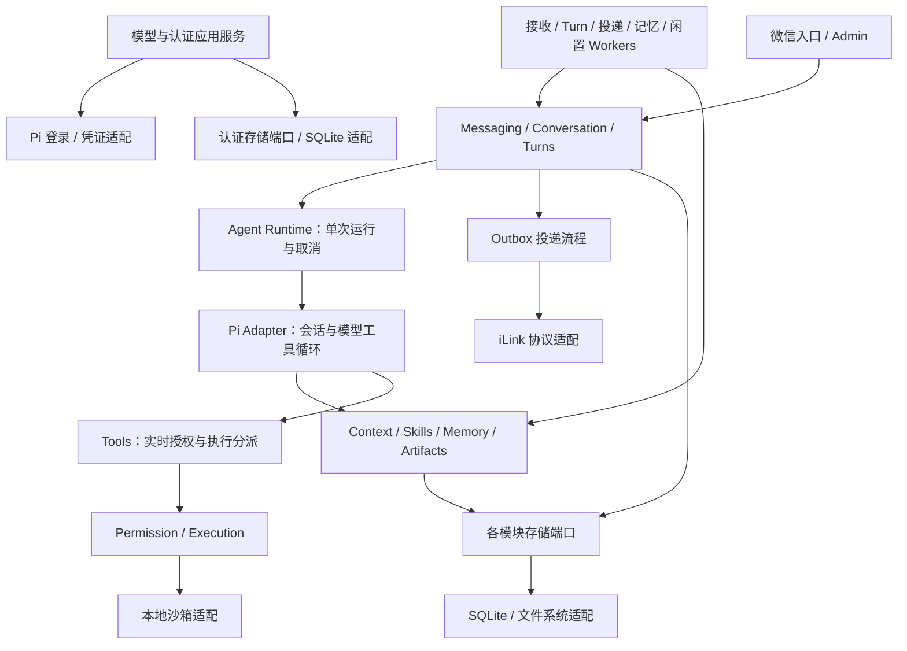

# 2026-09-10：模块化与工作流实现

本图描述当前工作区重构实现，不代表已部署。要求见 [R-001](../../../specs/system-refactor/spec.md)，过程与证据见 [迁移记录](../../../changelog/r001/implementation.md)。

模块内部按 application/domain/ports 组织；跨模块经 index.ts。协议适配器实现端口，Bootstrap 负责具体依赖组装。图的调用箭头不表示核心代码依赖 SQLite/Pi 的具体实现。

## 关键边界

- MessageStore.ingestBatch 仍原子提交 Inbox/cursor/会话关联/Turn；TurnStore.completeTurn 仍原子保存执行结果和 Outbox；SessionLifecycleRepository.endSession 仍同事务归档并创建记忆任务。
- ControlPlane 仅在 SQLite 适配内部组合多个端口，应用侧不再依赖它。认证流程不直接访问 SQL。
- SQLite 领取 Turn 排除同一会话的 RUNNING 项；Agent Runtime 同时保护 SDK 会话执行，重复调用明确失败。
- 启动仍归档旧会话并取消遗留 Turn；Outbox 和记忆阶段继续原有恢复方式。不新增通用进程恢复或检查点。

后台循环由 workers 驱动，bootstrap/lifecycle.ts 协调停止领取、30 秒收尾和取消。模型管理、图片/PDF、上下文回执、权限、记忆、Trace/Admin 均保留。

[重构前基线](../2026-09-09/current-system-2026-09-09.md) 和旧 PNG 仍供追溯，不作为当前精确模块落点。

H-001 接入后的当前执行主链、事务与控制边界见 [Task 运行边界](task-runtime.md)；本页重构基线图不包含后续 Task 节点。

F-002 本地图片回复接线见 [图片回复运行边界](image-replies.md)，实际部署及微信送达尚待验收。
