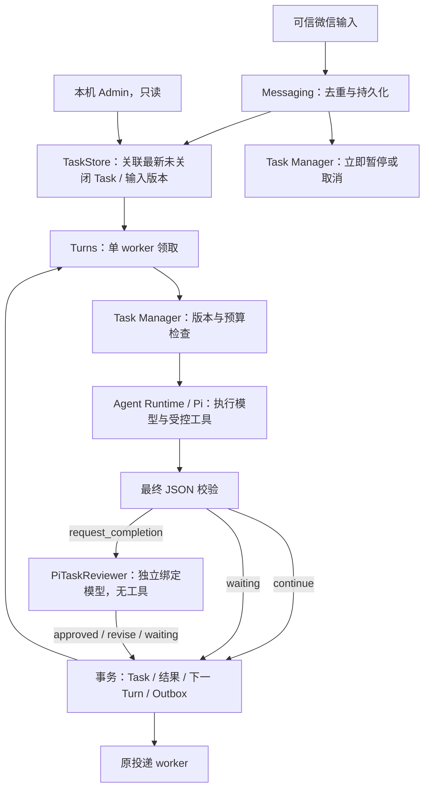

# Task 运行边界

H-001 本地代码已实现，尚未部署。规范见 [spec](../../../specs/agent-harness/spec.md)，验证见[证据](../../../specs/agent-harness/evidence/README.md)。

- tasks/application 管业务控制；tasks/domain 定义状态与协议；tasks/ports 定义 TaskStore、TaskReviewer；SQLite/Pi/DryRun 适配器实现端口，bootstrap 组装。没有第二个执行调度器。
- Conversation 管会话生命周期；Task 管目标、输入版本、进展与预算；Turn 管一次排队/运行请求；Pi 管该次 Run 的模型工具循环。
- 执行模型发出前原子消费 Task 预算，禁用 Provider 内部重试；Review 独立计数与模型绑定。新输入/暂停/取消直接打断在途 Run/Review，提交仍复核版本与状态。
- SQLite migration 9 的部分唯一索引保证一个未关闭 Task；内部续跑保留真实 Inbox 来源，拥有独立 Turn ID/source/input_text。完成事务同时处理状态、回复和下次请求；失败会协调暂停，避免孤立 REVIEWING。
- Context 读取最新任务和有序输入；Memory 提取区分内部执行输入与用户话语。上传未知目标文件进入 WAITING；向已有目标补文件可以继续执行。
- WAITING/PAUSED 阻止闲置归档。主动 /new 和启动恢复取消旧会话未完成 Task，保留历史；没有进程 checkpoint 或工具级恢复。

源码入口：[Task Manager](../../../../src/modules/tasks/application/task-manager.ts)、[SQLite Task Store](../../../../src/adapters/sqlite/sqlite-task-store.ts)、[Turn 流程](../../../../src/modules/turns/application/workflows/run-next-turn.ts)、[Review](../../../../src/adapters/pi/pi-task-reviewer.ts)。

## Task Trace 投影

Tasks 应用层的 taskTrace 先检查 owner，再通过 TraceQuery 读取关联 Turn/Step/Outbox；组合现有 Task 输入、控制和 Review 事件。管理接入层只渲染视图。Task Manager 在执行时记录目标/输入快照及 Outcome，Review 事件关联完成申请。运行记录不再按最近 100 条截断任务关联，底层 Trace 快照仍服从既有保留策略；缺失记录不重建。控制回执关联的应用请求参与投递查询，但不被当成 Agent Run。
