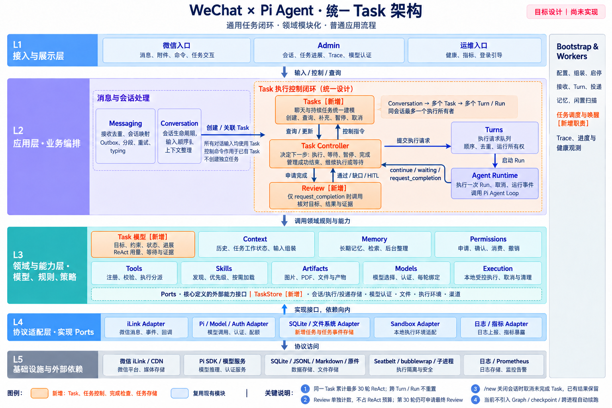
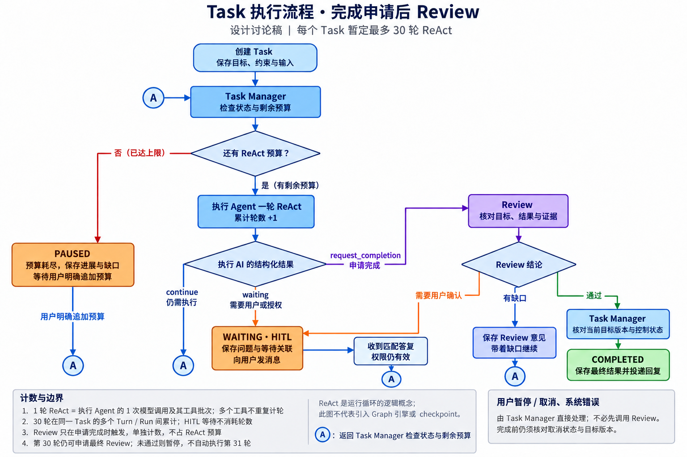

# 统一 Task 架构与执行流程

当前以 [H-001 spec](../../../specs/agent-harness/spec.md) 为准。用户已确认统一 Task、完成申请后 Review、HITL 与累计 30 轮 ReAct；本地代码已实现，尚未部署。本文保留设计阶段图示与标签，当前运行边界见 [Task 运行边界](../../current/2026-09-10/task-runtime.md)。

## 系统架构

聊天与持续工作统一使用 Task。Conversation 可以有多个 Task，每个 Task 可以有多个 Turn/Run，同一会话同时最多一个执行所有者。控制命令直接操作已有任务，不递归创建任务。

图中 Task Controller 与 spec 的 Task Manager 表示同一控制职责；Tasks 应用入口、任务控制与 Review 都属于 tasks 模块。Context、Memory、权限、工具、Skills、文件、模型和沙箱复用现有模块。

## 执行与 Review

只有 request_completion 进入 Review。continue 回到预算检查，waiting 进入 HITL；Review 通过后才能完成，有缺口则使用剩余预算继续，需要确认则 HITL。流程图 A 是回到 Task Manager 的连接符。

同一 Task 初始最多 30 轮 ReAct，跨 Turn/Run 不重置，工具批次按一次模型轮次计数。Review 单独计数，不占 ReAct 预算；第 30 轮仍可申请最终 Review，有缺口且无预算则暂停，用户明确追加后才可继续。

此图表示普通应用调用逻辑，不要求 Graph 引擎、checkpoint 或跨进程自动续跑。/new 关闭会话时取消未完成 Task，历史结果保留。

图像使用内置 imagegen 生成并检查；[架构提示词](assets/task-architecture-v2.prompt.txt) · [流程重绘说明](assets/task-flow.prompt.txt)。旧 task-architecture.png 为早期讨论图，不作为现行依据。
