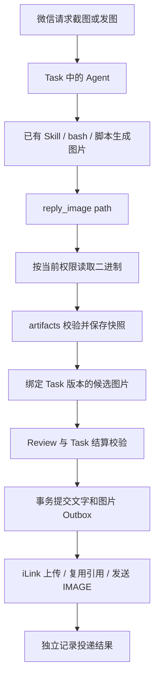

---
{
  "id": "F-002",
  "title": "截图与微信图片回传",
  "kind": "feature",
  "maturity": "experimental",
  "status": "implemented",
  "lifecycle": "planned",
  "affects": [
    {
      "id": "F-001",
      "sections": [
        "F-001-2",
        "F-001-6",
        "F-001-7"
      ]
    },
    {
      "id": "H-001",
      "sections": [
        "H-001-5",
        "H-001-7",
        "H-001-10",
        "H-001-11"
      ]
    },
    {
      "id": "R-001",
      "sections": [
        "R-001-04",
        "R-001-05",
        "R-001-06",
        "R-001-08",
        "R-001-11",
        "R-001-14"
      ]
    }
  ],
  "changes": [],
  "effective": null
}
---

> 实现核对：[版本化核对记录](reviews/README.md)

# F-002：截图与微信图片回传

用户已确认实施：复用现有 Skill、脚本和 bash 生成图片，只新增统一图片回复及其投递链路，同时修复截图执行环境。本文是该范围的唯一需求与技术契约，不另外维护 capture_desktop/capture_webpage 原生工具设计。[计划与状态](../../changelog/planned.md#f-002-截图与微信图片回传)

## 1. 目标与范围

在微信中要求助手截图或发送已有图片，最终收到可直接打开的微信图片。返回文件路径、Markdown 图片链接或工具声明不等于送达。

- 网页截图复用 playwright-cli；桌面截图复用 macOS screencapture，可按任务写脚本。
- 提供一个 reply_image 工具，统一登记 PNG/JPEG 快照；Task 审核通过后交给 Outbox 上传并发送。
- 修复工具临时目录过长，提供完整项目截图 Skill；保留权限、取消和进程清理约束。
- 不新增媒体服务、截图原生工具、浏览器常驻服务、任意联系人转发、其他媒体格式回传或模型切换功能。
- 受限模式和 Full Access 沿用原权限契约，不因截图而自动提升权限。桌面还依赖实际宿主进程的 macOS 采集授权与图形会话。
- 独立浏览器不自动继承个人浏览器登录资料，不承诺直接打开已登录飞书文档；该场景需要明确登录会话方案。

## 2. 当前依据

| 事实 | 依据与边界 |
|---|---|
| 原 TMPDIR 被设为用户长工作目录，失败 socket 长度超过本机 Unix socket 容量 | supervisor / executor；短路径已通过本地空白网页截图验证 |
| bash 调用不提供跨调用浏览器会话保证 | 每次执行清理临时目录与后台进程；CLI 可能 detached，Skill 显式关闭自身会话 |
| 桌面曾返回 could not create image from display | 只证明采集失败，不能单凭此错误断定唯一系统权限原因 |
| iLink 原出站为文本，图片上传协议已有官方源码依据 | [固定 Tencent 上游版本与字段](../../vendor/ilink-image-upload/SOURCE.md)，真实账号发送仍须单列验收 |
| Task 的审核和 Outbox 送达是两个事实 | 保持 H-001 / H-002；图片不能绕过审核或通过旧版本结果发送 |

## 3. 端到端流程与模块职责



- artifacts：快照、内容校验、归属、额度与清理；图片出站与 PDF 入站共用模块，物理表分离。
- execution / permissions：授权读取、工具临时目录和执行生命周期；不负责微信投递。
- adapters/pi：一个 reply_image 工具和可信上下文绑定；不从模型文字提取发送指令。
- tasks / turns：审核、版本与控制状态检查、候选发布和结果事务。
- messaging：租约、顺序、重试和送达状态；adapters/ilink 负责实际上传加密与微信协议。
- bootstrap 组装依赖；跨模块通过 index.ts/ports，不新增数据库或 Graph。

## 4. 截图复用与执行环境

每次工具执行创建独立短 `/private/tmp/pi-tool-*`，与可信 broker 临时目录分开。工具仅能使用本次临时目录，受限模式仅增加这一路径的必要读写，不扩大原网络/Unix socket 权限。sandbox wrapper 内显式设置 TMPDIR，避免运行时覆盖回公共目录；正常、失败、超时和取消均清理。

项目提供 [screenshot-reply Skill](../../../skills/screenshot-reply/SKILL.md)，无需修改全局不完整的 Playwright Skill。一次 bash 内用唯一会话完成打开、截图、关闭，trap 收尾；不执行 kill-all、不接管用户浏览器、不自动安装依赖。图片写在个人工作目录下，不能留在会被清理的 TMPDIR。通用 bash 的 120 秒上限保持不变。

桌面使用现有系统命令。明确系统拒绝时说明授权需要；只有通用采集失败时说明可能涉及宿主授权/图形会话，不编造唯一原因。应用内 Full Access 不等于系统屏幕录制授权。真实桌面验收必须来自实际服务启动链，不能用另一终端的成功替代。

## 5. reply_image 工具与快照

拟定行为已按用户确认范围落入以下接口：

```text
reply_image({path: "output/screenshot.png"})   添加一张候选图片
reply_image({action: "clear"})                清空当前 Task 版本候选，便于替换
```

- owner、taskId、revision、turnId 从可信上下文推导，工具不能指定收件人、身份、上传密钥或媒体引用。
- 仅在 Task RUNNING 且版本仍有效时登记；每个版本最多 3 张，按登记顺序发送；clear 后可重新添加。
- 同一 toolCallId 幂等复用原快照，不重复读取变化后的源文件；新调用是新快照，不按内容哈希阻止用户再次发送相同图片。
- 返回 ID、格式、尺寸和“已保存候选，尚未送达”，不返回图片二进制。Markdown、用户伪造 ID 或模型自报 replyImages 不触发投递。
- 候选持久绑定 Task 版本，内部续跑可复用；新输入递增版本后不自动沿用旧发送意图。

内部 read-binary 操作复用 acquire/PolicyCompiler/Executor，未注册成独立模型工具。图片通过受限大小的执行器私有管道传输（内部 base64 编码），在可信父进程解码；编码内容不经过 Pi 工具响应、模型上下文或 Trace。

读取限制：真实路径与普通文件检查、拒绝叶子符号链接、O_NOFOLLOW 打开、父目录/文件/fd 身份前后核对、实际读取上限和取消检查。图片导入即使 Full Access 也拒绝配置中的控制面保护路径；不改变原 Full Access bash 的语义。Node 层检查不宣称能对抗拥有本机权限的恶意进程反复置换祖先目录；受限模式仍由 OS 沙箱执行边界。

PNG/JPEG 使用 sharp 0.34.5 完整解码及结束标记校验，最多 10 MiB、2500 万像素、单帧。拒绝异常/超限，不静默裁剪或压缩。保存路径为 `DATA_DIR/outbound-images/<owner>/<artifactId>`，目录 0700、文件 0600；独占创建、写完并同步后登记数据库。数据库仅在快照成功后保存 ready 元信息。

来源文件以后变化不影响快照；投递读取校验大小与 SHA-256。文件与数据库不是跨介质事务，崩溃孤儿由启动清理处理。路径、令牌或图片内容不得自动沉淀为长期用户记忆。

## 6. Task 发布与数据事务

TaskManager 在完成申请时加载可信候选列表并核验快照，送入 Review 的 attachments 元信息，与模型自报 evidence 区分。Review 保持无工具模式；元信息证明快照有效，不能证明任意像素内容或已登录网页状态。普通截图/发图请求中，可信附件加上连贯执行结果且无具体矛盾即可通过；不能因为 Review 看不到像素而要求 OCR、重复截图或额外登录证明。只有用户明确要求内容核验，或已有证据显示目标错误/执行失败时，才检查对应缺口。

只有 approved 后才产生 replyImages。continue/waiting/revise/取消/暂停/异常/过期结果不得发布图片；执行模型返回的同名字段被清空。图片发送目标在审核时核对产物与登记即可，不能要求先完成网络送达才批准，造成循环等待。仅当系统已验证的候选附件非空时，request_completion 允许空 result，以支持用户只要图片的请求；无附件的空结果仍按原协议拒绝。

CompleteTurnInput 保留兼容的文字 chunks，新增 imageIds。结算事务检查 Task、版本、状态、候选和归属，同时保存 Task 结果、Turn 状态和 Outbox。失效 settlement 同时清空文字与图片；没有 Task 完成结算不得写图片 Outbox。允许 chunks 为空且含图片。

文字按原 chunker 分段，然后逐张追加图片；一张图一条 Outbox，稳定 ID 为 turnId + partIndex。结果事务失败整组回滚，重复结果不新增第二组。Outbox 使用可空 artifact_id 区分图片和历史文本，不伪造图片占位文字。

Task COMPLETED 表示审核完成，Outbox SENT 表示渠道请求成功；仍需真实微信可打开图片才能作为端到端验收。UI 分开显示任务完成和投递状态。结算后已提交的回复按既有 Outbox 策略继续发送，后续 /new/取消不提供撤回保证；结算前候选随取消失效。

## 7. iLink 上传、租约与顺序

按固定官方源码实现：getuploadurl → AES-128-ECB/PKCS7 → CDN POST → 读取 x-encrypted-param → IMAGE 消息。aes_key 为 hex 文本再 base64；mid_size 为密文长度；no_need_thumb=true。详见 vendor 依据，不从入站解密猜测协议。

Channel 增加 prepareImage、sendPreparedImage、imageCredentialScope；保留 sendText 兼容现有文字通道。上传 HTTPS、不跟随重定向、不向 CDN 传 bot Authorization；图片接口失败只保留通用阶段/状态码，不持久保存远端错误正文中的潜在签名信息。

Outbox 私有保存 prepared_image_json、prepared_image_scope。引用按当前凭据作用域隔离，上传成功写入后，发送重试和进程重启可复用；凭据改变重新上传。引用不放进 getTurnDetails/Task Trace 的公开消息对象。上游未提供可靠 TTL 或失效错误分类，因此不编造过期判断；重复失败走有限重试与死信，新发送请求可重新上传。

上传/发送期间续租；每次准备持久化、发请求及结算前检查 owner + attemptNo + 未过期租约。旧 worker 丢失租约不得继续发送或覆盖新领取者。上传后落库前崩溃可能重传形成远端孤儿；发送超时可能已经送达，不承诺远端恰好一次。

同 Turn 的后续 part 仅在前一条 SENT 后领取；前一条重试不得越序，DEAD_LETTER 后其余 part 保持阻塞。其他 Turn 可继续。网络失败仅重试 Outbox，不运行 Agent、不重新截图；已 SENT 的文字不会因为后续图片失败而重发。

## 8. 存储、清理与默认接线

migration 10 新增 image_artifacts、image_reply_selections 及 Outbox 图片/上传引用列，旧记录仍是文本。复用 app.db，不改 PDF user_files/model_file_refs。

单用户有效出站快照总量最多 500 MiB，与 PDF 配额分离。清理只在启动恢复后、workers 启动前执行，避免并发选取与删除；保留非终态 Task 的图片、所有非 SENT Outbox 引用以及最近 7 天终态/已发送引用。其余快照满 7 天可删除原件并保留 deleted_at 元信息。未登记文件超过 24 小时清理；未知目录、符号链接、近期文件不动。

死信及其阻塞后续项持续保留，不自动删；额度不足时明确报错，需人工处理失败队列。停止的进程不会后台清理；持续运行期间可能占满额度，下一次维护重启会按引用规则回收。不同生命周期的真实自动清理需求另行扩展，不能删除待投递原件凑额度。

图片回复是基础能力，Bootstrap 默认注册 reply_image 并接入 Task 附件发布和 Outbox，不提供额外功能开关。截图 Skill 沿用现有 Pi 加载配置，图片发送本身不依赖 Skill。上线前备份数据库；必须使用理解 migration 10 的版本回退，不用旧二进制直接打开新库。代码交付不自动修改用户 .env 或重启当前服务。

## 9. Trace、错误与用户反馈

image_selected 和 image_delivery 事件关联 artifactId/turnId/outboxId/阶段尝试；Trace 展示登记、上传、发送成功或失败。Task 时间线标为图片投递；不新增原图预览接口，不公开磁盘路径供任意访问。

- 图片不合法、文件不可读、超限、任务已变化：登记失败，不加入候选。
- 上传失败：原图保留，重试上传；发送失败：复用已保存引用，有限重试。
- 丢失/损坏快照：明确错误，不悄悄重新截图。
- 最终投递失败：Task Trace/状态查询可见，不递归创建同渠道错误通知。
- 工具登记及模型回复不能声称图片已经送达。

## 10. 验收条款

| ID | 条件 | 验证范围 |
|---|---|---|
| F-002-1 | 复用完整截图 Skill / 脚本，不新增截图原生工具；真实网页截图生成可读 PNG | local |
| F-002-2 | 短 TMPDIR 与 broker 隔离，两种模式及取消清理不回归；不自动放宽权限 | local |
| F-002-3 | reply_image 授权读取、格式/大小/像素、归属、保护目录、快照和取消检查有效 | local |
| F-002-4 | 最多 3 张、顺序/清空/幂等、跨 Run 延续、版本隔离；输出无图片编码 | local |
| F-002-5 | 仅有效 approved 发布；其他结果/取消/过期/模型伪造不发图，Reviewer 收到可信元信息 | local |
| F-002-6 | Task/Turn/Outbox 事务一致、纯图片可发布、缺失候选拒绝、重放不重复入队 | local |
| F-002-7 | 官方协议来源固定；加密上传/IMAGE mock 契约及真实微信可打开图片分别验证 | local / external |
| F-002-8 | 持久媒体复用、凭据变化、租约丢失及重试不重跑 Agent 有故障验证 | local |
| F-002-9 | 重试不越序、死信阻塞后续、历史文字保持兼容 | local |
| F-002-10 | 配额/启动清理保留活跃与待投递原件；孤儿文件受限清理 | local |
| F-002-11 | Trace 区分登记/上传/送达，私有引用不泄露；PDF/入站图片/权限原能力回归 | local |
| F-002-12 | migration/默认接线/构建验证；实际宿主桌面与微信端到端单列 | local / external |

实际验收记录统一在 changelog/evidence，检查器通过不代表功能实测。实现验证按 package.json 的完整 check，禁止 Go build/test/vet。真实发送只在用户明确授权的测试会话进行，截图不默认采集私人桌面作为探针。

## 11. 交付顺序与关系

协议源码核对 → 固定图片快照与投递 → 现有截图环境修复 → Task/Outbox 故障验证 → 文档/完整检查 → 单独的实机验收。收尾先 project-spec-review，再 project-change-sync；有实际发现才按 project-learning-sync 沉淀。

F-001 的 PDF 输入保持原契约，F-002 新增图片出站；H-001 提供审核与任务控制；H-002 提供 Trace 聚合，媒体事件接入既有界面；R-001 约束模块/事务/恢复。F-002 未 effective 前不把其他规格当前行为改写成已上线。

## 12. 实现导航

[工具](../../../src/adapters/pi/tools/image-tools.ts) · [图片服务](../../../src/modules/artifacts/application/image-reply-service.ts) · [存储](../../../src/adapters/filesystem/local-image-storage.ts) · [校验](../../../src/adapters/filesystem/sharp-image-validator.ts) · [TaskManager](../../../src/modules/tasks/application/task-manager.ts) · [SQLite 结算](../../../src/adapters/sqlite/sqlite-control-plane.ts) · [投递](../../../src/modules/messaging/application/workflows/deliver-reply.ts) · [iLink](../../../src/adapters/ilink/ilink-http-client.ts)
