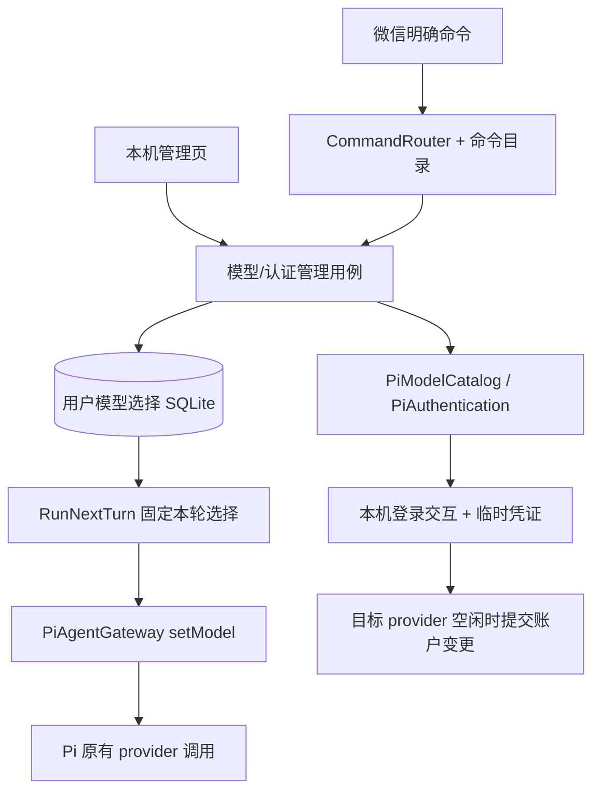

> 历史材料：不作为现行规格。请以 [spec](../spec.md) 为准；勾选和状态仅表示原记录时点。

# 模型、供应商与认证管理设计

状态：待评审，未实现。依据：2026-09-07 当前项目与已安装 Pi 0.84.3。本文新增命令、类型和接口均为设计，不代表已有功能。

## 1. 术语

- Provider：Pi 注册的模型服务通道，具有 ID、认证方式和 API 实现。
- ModelSelection：完整的 providerId + modelId，一次性保存，不存在“已换供应商但模型未选”的生效状态。
- TurnBinding：本轮实际使用的模型选择与认证版本；从开始到结束保持不变。
- AuthOperation：一次本机登录/重新认证操作，有独立 ID 和生命周期，与模型选择无关。

## 2. 需求与范围

目标：微信和本机管理页可查看供应商、检查认证、选择模型，并在不重启服务的情况下让后续任务使用新选择；提供明确帮助入口。认证在本机浏览器/受保护管理页完成，微信不接收密钥。

已确认的命令语义：`/model` 始终对应当前生效 provider；`/provider <id>` 只检查认证和展示该供应商模型；`/provider <id> <modelId>` 才提交切换。不保存隐式“待选供应商”。

**未知命令或语法不匹配的文本原样交给 Agent，不自动纠错、不返回帮助。** 只有完整匹配明确命令才执行管理操作。合法命令内遇到实际不存在的 provider/model、认证失败等，是业务结果，应明确回复且不修改配置。

本期不做：自然语言自动切换、自动跨供应商 fallback、聊天中接收 API Key、新增自定义 provider 编辑器、多账户同时在线路由、每个 Session 独立选模型。自定义 provider 仍通过 Pi 本机配置接入。

当前事实：启动读取 PI_PROVIDER/PI_MODEL_ID 或 data/settings.json；PiGateway 捕获启动选择；CommandRouter 仅识别 /new、/status；文件与记忆能力已在当前源码接入。已有 Trace spans 转换，需在其上扩展。

## 3. 总体设计



职责：命令解析不读数据库或调用模型；用例校验身份、编排并持久化；Pi adapter 封装 SDK；用户选择与本机凭证分别保存。微信和管理页使用同一个用例入口。

### 命令表

| 命令 | 行为 |
|---|---|
| -help / --help / /help | 总帮助，不调用模型 |
| /provider | 当前 provider；已配置/当前供应商及状态；提示 /provider all |
| /provider all | 分页展示 Pi 已注册供应商，包含未认证项 |
| /provider <providerId> | 检查认证；通过后展示目标模型；不改变生效选择 |
| /provider <providerId> <modelId> | 重新校验认证及模型，原子提交完整选择 |
| /model | 当前 provider 的模型列表及当前模型 |
| /model <modelId> | 只在当前 provider 内选择模型 |
| /auth | 供应商本地认证状态 |
| /auth <providerId> | 认证方式、可取得的脱敏账户信息及操作指引 |
| /auth <providerId> login | 发起本机认证；已有可用凭证时提示使用 reauth |
| /auth <providerId> reauth | 发起重新认证，允许更换账户；不先 logout |
| /model -help、/provider -help、/auth -help | 对应帮助；兼容 --help |

`/models` 可作为 `/model` 的只读别名，指向当前 provider，不额外引入跨供应商含义。列表用现有消息分段器分段；供应商/模型的长列表需要有界分页（管理页分页；微信可提供明确 `/provider <id> page <n>` 和 `/model page <n>` 形式，并纳入同一命令目录）。

帮助只列实际已实现的命令与准确别名。不要通过全局字符串包含“-help”判断：如“解释 /model -help 的含义”必须原样进入 Agent。参数数量不匹配（如 `/model a b`）同样原样透传。完整匹配的 `/model missing-id` 则返回“当前供应商没有该模型”。管理命令附带文件/图片时首版按普通消息处理，避免附件被管理分支跳过保存；帮助中注明管理命令须单独发送。

## 4. 详细设计

### 4.1 用户模型选择

存储以现有可信 `subjectKey` 为范围（包含用户、executor、workspace），跨该范围内的 Session 和重启生效。不是进程全局一个模型，也不是 Session 专属。

优先级：用户持久选择 > 首次初始化时的环境配置/现有 data/settings.json。环境配置作为默认值，不在重启时覆盖用户已经保存的选择。现有绑定只用作默认，不覆盖其他数据。

SelectModel 用例：

1. 从可信调用上下文取得用户身份。
2. 通过 Pi 查 provider 与模型，不根据 Claude/GPT 名称猜厂商。
3. 检查认证解析；已有适合的远端检查则使用它，不为验证随意发一轮计费推理。
4. 保存 providerId/modelId，递增 selectionRevision，返回完整选择。
5. 相同选择重复提交不递增版本；模型或认证校验失败保持旧值。

/provider <id> 的检查只是只读结果，后续提交仍需重查，避免期间凭证失效。没有待选 provider 状态。/model 的 provider 来源于当前持久选择，并在事务提交前验证 revision 未被并发操作改变；冲突返回“选择已变化，请重新选择”，避免把模型切到另一个供应商。

### 4.2 何时生效与上下文

每轮在开始执行时获取一次 ModelSelection 并生成 TurnBinding，所有自动重试、工具往返、文件适配及 Trace 使用这一份模型。Pi 缓存会话与绑定不同时，在 prompt 前调用 `session.setModel(model, {persist:false})`；用户默认保存由应用仓库负责，不调用 Pi 的全局默认写入。

已运行任务保持原模型。未开始任务使用开始时的最新选择。同一 Session 保留上下文，后续请求可能将已有历史发送给新供应商；切换回执明确这一点。不可为兼容目标模型而静默删历史附件或工具结果，失败按内容错误返回。

微信命令当前与普通消息共用单 Turn worker，所以在一次长任务运行时，微信切换命令会排队，完成后才执行；管理页可以及时提交未来选择。首版保留这个差异，不承诺微信命令能抢占运行任务，不新增第二条聊天消费链路。

恢复重做的同一个 Turn 应复用已保存的 TurnBinding，不悄悄使用新选择；真正新增的权限续跑 Turn 采用新 Turn 开始时的选择。认证账户变更后，旧认证版本的失败 Turn 不得自动以新账户重做；标记需要用户重新发起，原消息/文件仍保留。

### 4.3 认证管理

供应商列表从 ModelRuntime.getProviders()/getRegisteredProviderIds() 取得，认证方式从 provider 定义读取。不能对所有供应商固定调用 login(provider, 'oauth')；Pi auth type 可以是 oauth 或 api_key，某些环境凭证通道没有交互登录实现。

状态区分：未配置、本地已配置、凭证解析成功、检查失败。`checkAuth` 成功不等同于服务端授权所有模型；目录列表也不保证账号有每个模型的调用权限。provider 未暴露账户标识时显示“账户信息不可用”，不从密钥推断邮箱。

认证操作流程：CREATED → WAITING_LOCAL → AUTHENTICATING → READY_TO_COMMIT → WAITING_IDLE → SUCCEEDED；另有 FAILED/CANCELLED/EXPIRED。建议有效期 10 分钟，属于拟新增应用限制。

微信命令仅创建操作并返回 ID 和本机管理入口指引。手机上的 127.0.0.1 不是服务器，因此回复写“请在运行 Agent 的电脑打开管理页完成认证”，不要给用户承诺手机可直接访问 localhost。

本机页展示认证方式和 provider 提供的登录 URL；回调、设备码或密钥只在本机完成。临时 ModelRuntime 使用隔离 CredentialStore 执行 Pi 登录。候选 credential 不写入共享正式 store；成功后才进入提交阶段。认证失败/取消销毁候选，旧凭证不变。Pi 支持注入 CredentialStore，具体 provider 登录及同步行为需集成测试，不直接假设 runtime.login 可以提供两阶段提交。

当前项目共享宿主机 Pi 凭证，首版只允许已有可信本机所有者发起账户变更；不能因为模型选择按用户存储，就误认为凭证也是用户隔离的。将来多租户必须另做独立 credential store。管理页不可仅凭任意传入的 userId 代表微信用户，应使用服务端绑定的 owner 上下文。

### 4.4 账户切换与并发

ProviderRequestGate 跟踪当前 provider 的所有活动模型任务，包括聊天、记忆提炼/合并、文件上传/链接刷新。账户变更准备完成后进入 drain：暂停该 provider 新任务准入，等待已有任务退出，再替换目标 provider 的 credential，刷新 runtime 状态并递增 credentialRevision，最后恢复准入。

同一 provider 存在的其他工作不能绕过 gate。已有 Turn 不在多轮工具往返间释放 gate，否则会发生半轮换账户。等待超过建议 2 分钟则返回“仍在等待当前任务”，提供本机取消认证提交；不能强杀任务或偷偷提前替换。候选凭证过期时要求重新认证。

凭证文件和 SQLite revision 无法跨介质原子提交：使用持久 commit journal，标明 provider、旧/新非敏感 revision 和阶段；进程崩溃重启先在 gate 关闭状态核对正式 store、刷新 runtime、完成 revision 恢复。密钥不写 journal。可用临时候选安全存储和文件原子替换实现，但应使用 Pi 正式 CredentialStore.modify 的目标 provider 更新及锁机制，不能覆盖整份 auth.json。并发外部 Pi/Codex 进程也可能改凭证：首版需检测凭证身份变更并失效缓存；不能承诺能锁住所有外部调用。

认证提交与模型选择是独立操作。更换 Anthropic 账户不自动把当前 Codex 模型切过去；更换当前 provider 账户后保留模型选择，重新验证调用准备状态，实际模型访问被拒时明确提示选择其他模型。

### 4.5 文件、记忆与 Trace 适配

PiGateway 中所有基于启动 options 的 provider/modelId 分支改用 TurnBinding。文件工具不得捕获创建 Session 时的 model，文件 router 的 assertSupported、上传和 onPayload 均使用本轮模型。

远端文件引用按 provider/API/实际服务范围和认证身份或 credentialRevision 隔离。账户变更后旧引用不能供新账户复用；本地原件保留，需要时重新上传。普通 token 刷新不应等同于账户切换而清空全部缓存；身份无法可靠判断时保守用认证 revision 隔离。

记忆后台任务在真正开始调用时固定模型与认证版本；一次提炼/合并不在中途切换，独立记录实际 provider/model。统一复用 PiModelCatalog/运行时服务，避免网关和 PiMemoryGenerator 各自永久捕获旧配置。

接入当前 trace-model.ts 的 span 转换，增加 model_selection_changed、provider_auth_check、provider_auth_operation 等事件。每轮实际模型仍以 model_call/AgentInvocation 为准；不能用“用户当前默认”回填历史。管理页操作没有聊天 Turn，可存操作审计事件，并通过 operationId 关联；微信发起则额外关联其命令 Turn。

日志/Trace 不记录 API Key、OAuth code、访问/刷新 token、完整回调 URL、签名文件 URL。认证 URL 不进入普通聊天记录；本机操作接口只返回必要交互状态。

### 4.6 文件结构与职责

```text
src/
├── domain/models/
│   ├── model-selection.ts
│   └── provider-auth-operation.ts
├── application/
│   ├── interfaces/
│   │   ├── model-catalog.ts
│   │   ├── model-selection-repository.ts
│   │   └── provider-authentication.ts
│   ├── services/
│   │   ├── command-router.ts                 # 扩展现有精确匹配
│   │   └── command-catalog.ts                # 帮助/语法/示例同一来源
│   └── use-cases/
│       ├── get-model-options.ts             # 目录、认证摘要和模型列表
│       ├── select-model.ts                  # 校验 + 原子保存完整选择
│       ├── manage-provider-authentication.ts # 创建/查询/取消本机认证操作
│       └── run-next-turn.ts                 # 执行已识别命令/绑定模型
├── adapters/
│   ├── inbound/admin-http/
│   │   ├── model-routes.ts
│   │   ├── auth-routes.ts
│   │   ├── model-settings-page.ts
│   │   └── trace-model.ts                   # 扩展现有 span 类型
│   └── outbound/
│       ├── sqlite/
│       │   ├── sqlite-model-selection-repository.ts
│       │   └── sqlite-provider-auth-operations.ts
│       └── pi/
│           ├── pi-model-catalog.ts
│           ├── pi-provider-authentication.ts
│           ├── provider-request-gate.ts
│           ├── staged-credential-store.ts
│           ├── pi-agent-gateway.ts          # 使用 TurnBinding + setModel
│           ├── pi-memory-generator.ts       # 后台任务模型绑定
│           └── file-input/                  # 保留现有结构，改读实际模型/认证范围
└── bootstrap/container.ts                   # 组装共享 runtime/服务/gate

test/
├── unit/application/model-commands.test.ts
├── unit/application/select-model.test.ts
├── unit/pi/provider-authentication.test.ts
└── integration/model-switching.test.ts
```

这是职责落点，不要求把每个一行函数拆文件。认证操作仓库接口可放 provider-authentication.ts 同一模块，避免为小类型增加文件。新增 provider 复用 Pi 目录和认证实现，不在应用层为 Anthropic/Google 各写一套模型切换流程。

## 5. 接口与数据定义

拟新增核心类型：

```ts
interface ModelSelection {
  providerId: string;
  modelId: string;
  revision: number;
}
interface TurnModelBinding extends ModelSelection {
  credentialRevision: number;
}
interface ModelCatalog {
  listProviders(): Promise<ProviderSummary[]>;
  listModels(providerId: string): Promise<ModelSummary[]>;
  checkAuthentication(providerId: string): Promise<AuthSummary>;
  resolve(providerId: string, modelId: string): Promise<ResolvedModel>;
}
```

应用接口不暴露 Pi Model 类型；ResolvedModel 仅描述稳定标识，adapter 内再取得真实 Pi model。模型/供应商名称从目录展示，不硬编码。

新增存储：

- user_model_settings：subject_key 主键，provider_id、model_id、revision、updated_at。
- turn_model_bindings：turn_id 唯一，provider_id、model_id、selection_revision、credential_revision、bound_at。
- provider_auth_operations：operation_id、owner、provider、状态、时间、错误分类、关联 Turn；不包含 token。活跃候选由受保护 staging 管理。
- provider_credential_revisions / commit journal：认证变更及恢复标记；凭据正文仍交给 Pi CredentialStore。

拟新增本机管理 API：

| API | 含义 |
|---|---|
| GET /admin/models/providers | 目录与本地认证摘要 |
| GET /admin/models/providers/:id/models | 检查认证后列模型 |
| GET /admin/models/selection | 当前 owner 选择 |
| PUT /admin/models/selection | 校验并提交 providerId/modelId/expectedRevision |
| POST /admin/auth/operations | 创建 login/reauth 操作 |
| GET /admin/auth/operations/:id | 只读操作进度 |
| POST /admin/auth/operations/:id/input | 本机提交该操作预期的输入 |
| POST /admin/auth/operations/:id/cancel | 取消未提交操作 |

必须按 HTTP method 路由；GET 不提交切换或认证。管理写操作需要 loopback 限制、Origin/Host 检查、CSRF token/本机控制凭证及请求大小限制，认证数据响应 no-store。OAuth 的预期浏览器回调单独按 state/PKCE 匹配，不能用放开所有 CORS 替代。此处是新增写入口的必要边界，现有 Trace 只读接口不能原样承担凭证写入。

## 6. 架构指标与兼容性

可靠性：切换不打断本轮；认证替换 drain；并发选择采用 revision；失败不改变当前配置。认证状态检查不是完整远端可用性承诺。

兼容性：旧设置无用户记录时走现有默认；数据库使用增量 migration；/new、/status、权限指令及 /skill 保持原行为。未知 slash 指令继续传入 Pi，让 Pi 现有 /skill 处理仍可工作。不要在通用 router 中吞掉所有斜杠消息。

观测：选择/认证操作成功失败次数及耗时；provider 可作有限标签，用户 ID 和 operationId 放审计字段，不放 metrics 标签。

## 7. 质量保障与发布回退

验证重点：精确帮助匹配和原文透传；两步切换不产生中间生效态；并发 /model 与 /provider；相同请求幂等；切换时工具仍使用原模型；下一轮文件路由随目标模型变化；后台记忆任务一致性；认证取消不损坏旧凭证；认证提交失败和重启恢复；凭证脱敏；Admin 写入口防跨站调用。真实 OAuth/API Key 登录分别验收，不能以 mock 通过宣称全部 provider 可用。

发布建议新增 MODEL_MANAGEMENT_ENABLED 默认关闭，在完成单用户验证后开启。关闭后停止新管理写入，但已保存选择继续可读并用于任务，避免关开关突然切回旧模型；帮助不展示禁用操作。回退优先关闭入口、保留理解新 schema 的版本；若回滚旧二进制，必须考虑当前 healthCheck 的 migration 版本严格匹配，使用配套备份而不是在线删表。

## 8. Checklist

- [x] /model 只针对当前 provider。
- [x] /provider 检查与提交分开，无隐藏待选状态。
- [x] 未匹配语法原样交给 Agent。
- [x] 帮助与命令目录统一。
- [x] 认证前后保留旧凭证、提交 drain 及恢复边界。
- [x] 用户设置与宿主机共享凭证范围明确。
- [ ] 验证各 provider 的 staging 登录与 credential store 提交流程。
- [ ] 验证 AgentSession 保留历史跨协议切换。
- [ ] 验证 file-input 与后台 memory 不使用旧闭包模型。
- [ ] 验证真实登录和 Admin UI，完成安全/并发回归。

## 9. 错误与文案

仅对已识别合法管理命令返回业务错误；未匹配语法不走此表。

| 场景 | 提示 |
|---|---|
| /provider anthropic 检查通过 | 认证检查通过，以下为模型列表。当前模型未改变。 |
| 未配置认证 | 尚未配置认证，请使用 /auth anthropic login，并在运行 Agent 的电脑完成。 |
| 模型不存在 | 当前供应商未找到该模型，当前选择未改变。 |
| 切换成功 | 已选择 provider/model，后续任务生效；当前运行任务继续使用原模型。后续请求会向目标供应商提供本会话上下文。 |
| 认证失败/取消 | 认证未完成，旧账户保持不变。 |
| 等待运行任务 | 新账户已准备好，正在等待该供应商的运行任务结束后应用。 |
| 远端模型拒绝 | 目标服务拒绝本次调用，显示脱敏分类；不静默切回其他模型。 |
| 语法未匹配 | 无管理提示，原文交给 Agent。 |

## 10. 参考

- [现有命令路由](../../../../src/modules/messaging/application/command-router.ts)
- [RunNextTurn](../../../../src/modules/turns/application/workflows/run-next-turn.ts)
- [启动选择](../../../../src/bootstrap/pi-onboarding.ts)
- [Pi 网关](../../../../src/adapters/pi/pi-agent-gateway.ts)
- [记忆模型调用](../../../../src/adapters/pi/pi-memory-generator.ts)
- [现有 Trace span 转换](../../../../src/modules/observability/application/trace-model.ts)
- [Pi runtime API](../../../../node_modules/@earendil-works/pi-coding-agent/dist/core/model-runtime.d.ts:60)
- [Pi setModel](../../../../node_modules/@earendil-works/pi-coding-agent/dist/core/agent-session.js:1201)
- [Pi 可注入 CredentialStore](../../../../node_modules/@earendil-works/pi-ai/dist/auth/types.d.ts:44)

## 11. 实施拆解

1. 命令目录与帮助、严格语法匹配和未匹配原文透传；可独立交付。
2. 模型目录与用户选择存储；接入微信 provider/model 命令，先复用已经配置好的凭证。
3. TurnBinding、setModel、文件路由、模型 Trace 和后台记忆一致性；完成无需重启切换。
4. 本机认证操作、隔离 credential staging、provider gate 和提交恢复；完成账户更换。
5. Admin 页面/写入口保护、真实登录与跨协议模型测试，更新 README。

先完成已有凭证的模型切换，再交付认证管理，可以避免认证流程阻塞最基本的切换功能。不能在第四阶段之前宣称支持“安全更换账户”。不修改其他正在进行的架构设计文件。
